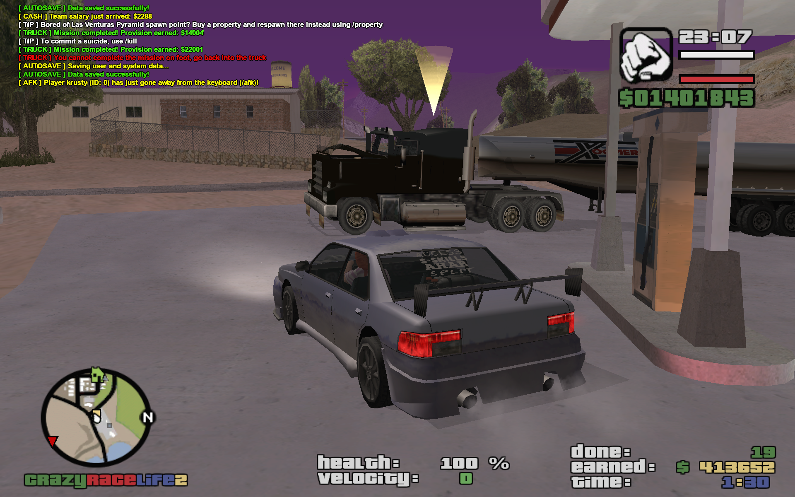

# CrazyRaceLife2 (CRL2)

A GTA SA:MP/openMP gamemode scripted in the pawn lang.


## Features

+ ATM for banking services
    + At least one ATM per city/town/village
+ Racing
    + Custom races all across the map
    + Air and ground
    + Stunts
+ Real Estate
    + Custom spawn point
    + Custom vehicle attached (including the modifitaions)
    + Custom safehouse
    + Up to 5 properties per player
    + Save custom skins (up to 5 per property)
+ Teams
    + Custom salary per team 
    + Special commands available
    + Custom weapons
+ Trucking
    + 15+ trucking points (petrol stations etc)
    + Custom missions
    + Weighted provision/bonus per done mission/delivery
+ Personal cellphone
    + Accessed easily via the `KEY_YES` key (Y usually)
    + Send private messages directly to a player
    + Check bank account balance
    + Call a service (car mechanic, pizza delivery, taxi ride, ...)
+ Admin Zone
    + Game editors (property, race and trucking point editting tools)
    + Admin levels 0 to 5 (+ RCON)
    + Granularity for commands


## Preview

### Trucking




## How to build

Fetch the `sampctl` tool for the `pawn` package management.

```
dnf install sampctl
```

Clone this repo and try to build it using the `build` command:

```
sampctl ensure
sampctl build

# or Simply
make build
```

The compiled `.amx` gamemode file should then pop up in the `gamemodes` directory.


## How to run

Simply put the compiled `.amx` gamemode file into the `gamemodes` directory of your SAMP server's. Then update the server config file (`config.cfg`, or `config.json`) like this:

```
gamemode crl2
```

```json
[...]
        "main_scripts": [
            "crl2 1"
        ],
[...]
```

The examples above are shown respectively to the config file names mentioned.

## Vademecum

### Command List

```
    /acc        --- game account info dump
	/admins     --- lists admins online
	/afk        --- (un)sets the Away-From-Keyboard state
    /animoff    --- clears all animations
	/bank       --- lists banking subcommands
	/cmd        --- lists available commands for player
	/dance      --- enables special animations (dancing)
	/deal       --- lists subcommands for dealerz 
	/deathmatch --- lists subcommands for the deathmatch module
	/drugz      --- lists substances in pockets
	/dwarp      --- teleports the player in vehicle to racing the common location
	/fix        --- repairs the player's vehicle
	/givecash   --- sends cash to other player
	/help       --- lists helper information
	/hide       --- (un)hides the player on map
	/kill       --- to commit suicide
	/lay        --- enables special animations (laying)
	/locate     --- dumps the actual player's coordinates 
	/lock       --- locks the player's vehicle
    /phone      --- shows the phone call menu
	/pm         --- sends the private message to other player
	/port       --- enables to warp to special locations on map
	/property   --- lists subcommands for property handling
	/race       --- lists subcommands for racing module
	/rules      --- dumps the server rules information
	/scores     --- shows the High Scores table
	/search     --- special command for Policemen
	/skydive    --- enables to skydive from random locations
	/text       --- sends a public message to other player
	/tiki       --- dumps the information about Tiki prizes
	/truck      --- enables/disables the Trucking missions
	/unlock     --- unlocks the player's vehicle
	/wanted     --- shows the wanted list of online players
```

### Admin Command List

```
	/acmd       --- (lvl 1) lists admin commands per level
	/admincol   --- (lvl 1) changes the player color according 
	/clear      --- (lvl 1) flushes the chat
	/flip       --- (lvl 1) flips the player's car
	/hp         --- (lvl 1) sets the 100 HP + armour to player
	/nitro      --- (lvl 1) sets the nitrous level to player

	/cam        --- (lvl 2) lists subcommands for camera view
	/countdown  --- (lvl 2) sets the seconds to start the countdown
	/get        --- (lvl 2) warps the player to admin   
	/goto       --- (lvl 2) warps the admin to player
	/skin       --- (lvl 2) sets the skin for player

	/crime      --- (lvl 3) plays the crime sound (Police T-Code), experimental
	/drunk      --- (lvl 3) sets the drunk level to a player
	/elevator   --- (lvl 3) operates the Admin elevator
	/kick       --- (lvl 3) kicks the player from server
	/packet     --- (lvl 3) prints the packet loss per player
	/reset      --- (lvl 3) resets cash for a player
	/spectate   --- (lvl 3) sets the spectate mode on a player
	/vehicle    --- (lvl 3) spawns a vehicle by ID
	/weapon     --- (lvl 3) sets a vehicle to a player
	/weapons    --- (lvl 3) sets the weapons pack to player

	/ban        --- (lvl 4) bans the player (via IP)
	/edit       --- (lvl 4) shows a dialog window with all common editors
	/fakechat   --- (lvl 4) sends the fake chat as a player
	/lvl        --- (lvl 4) sets the Admin level to player
	/restart    --- (lvl 4) sets the countdown for 60 seconds to restart the server
```

### Real Estate

Each property ID has to be unique server-wide. It is recommended to use 5-digit format like `40605`, where:

+ `4` stands for the greater zone ID 
+ `06` stands for a district/block ID (incremented)
+ `05` stands for a property ID within the same district/block

Greater zone IDs:

```
1 - San Fierro
2 - Desert
3 - Las Venturas
4 - Countryside, Farms
5 - Los Santos
```

## omp for Linux

```
-h "95.216.7.113" -p "39876" -n "krusty" -g "C:\\Program Files (x86)\\Rockstar Games\\GTA San Andreas\\"
```
