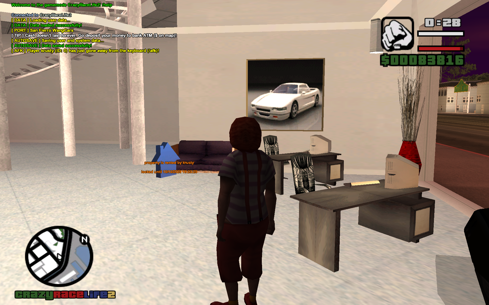
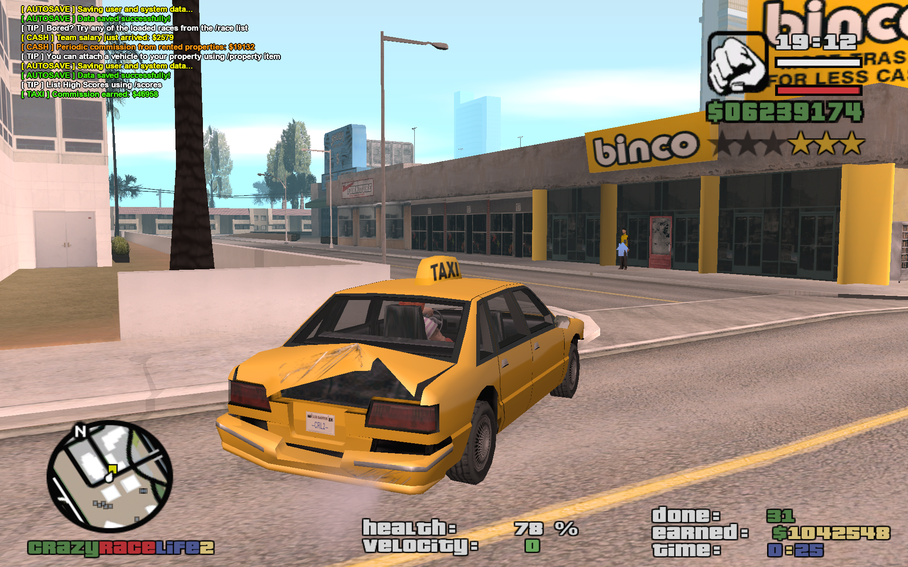

# CrazyRaceLife2 (CRL2)

A GTA SA:MP/openMP gamemode scripted in the pawn lang.


## Features

+ Admin Zone
    + Game editors (property, race and trucking point editting tools)
    + Admin levels 0 to 5 (+ RCON)
    + Granularity for commands
+ ATM for banking services
    + At least one ATM per city/town/village
+ Combat Missions (experimental)
    + Business robbery with numerous NPC shooters
    + Briefcase picking for money exchange ($0.5M per Briefcase) at the mission end
+ Personal cellphone
    + Accessed easily via the `KEY_YES` key (Y usually)
    + Send private messages directly to a player
    + Check bank account balance
    + Call a service (car mechanic, pizza delivery, taxi ride, ...)
+ Prizes
    + Tiki ($10M) and Pumpkin ($1.5M) pickups
    + Hidden on pick up automatically
+ Racing
    + Custom races all across the map
    + Air, ground and naval
    + Stunts
+ Real Estate
    + Custom spawn point
    + Custom vehicle attached (including the modifitaions)
    + Custom safehouse
    + Up to 5 properties per player
    + Save custom skins (up to 5 per property)
+ Taxi Missions
    + Ad-hoc NPC spawned for a player.
    + Randomized customer locations and targets.
    + Increased commissions for the taxi rides with done count.
+ Teams
    + Custom salary per team 
    + Special commands available
    + Custom weapons
    + Team chat using the exclamation mark at the beginning of a message (e.g. `!message`)
+ Trucking
    + 15+ trucking points (petrol stations etc)
    + Custom missions
    + Weighted provision/bonus per done mission/delivery


## Preview

### Racing


*^ Racing point right after registration into the race. Showing the racing point pickup with the racing point name `3DText` text. The first checkpoint starts the race when entered.*


### Real Estate


*^ The exterior of every common personal property shows the entrance point (white arrow pickup), the offer point (green/red house pickup according to the occupance state of such property), and custom vehicle attached.*


*^ The common interior shows 4 pickups in total: shirt pickup (to change the skin), pills pickup (to deposit/withdraw owned drugz and stuff), heart pickup (to gain full HP and armour), and the exit pickup (to exit the property interior).*


*^ The custom interior is an ad-hoc built interior (very limited occurance). Pickups are places to custom points, allowing the secondary exit(s) as well.*



*^ The commercial property exterior example. Occupied state is indicated via the `3DText` text with the tenant's name. This property can still be outbought by another player though.*


### Taxi Missions



*^ A random customer to take the taxi ride.*


*^ A random target generated by the customer.*

### Trucking


*^ The trucking mission details shown in the right bottom corner. The marked truck in the picture indicates that the mission is "paused" as the player has to drive it to continue the mission.*


*^ Detail of a detached trailer (decomposing in the sea waters). Custom information text is shown until the trailer is reattached back to the truck registered for the mission.*

### MapUI

MapUI is an util to parse and visualize the database data (coords) on the high-res GTA SA map (source: [reddit](https://www.reddit.com/r/sanandreas/comments/9856u1/high_resolution_map_for_grand_theft_auto_san/)). To run it, go to `utils/mapui` and just run it in console like this:

```shell
go run main.go
```

The MapUI tool is the available at [http://localhost:3000](http://localhost:3000).


*^ Detailed tooltip for a commercial property in the MapUI util.*

## How to build

Fetch the `sampctl` tool for the `pawn` package management.

```
dnf install sampctl
```

Clone this repo and try to build it using the `build` command:

```
sampctl ensure
sampctl build

# or Simply
make build
```

The compiled `.amx` gamemode file should then pop up in the `gamemodes` directory.


## How to run

Simply put the compiled `.amx` gamemode file into the `gamemodes` directory of your SAMP server's. Then update the server config file (`config.cfg`, or `config.json`) like this:

```
gamemode crl2
```

```json
[...]
        "main_scripts": [
            "crl2 1"
        ],
[...]
```

The examples above are shown respectively to the config file names mentioned.

## Vademecum

### Command List

```
    /acc        --- game account info dump
	/admins     --- lists admins online
	/afk        --- (un)sets the Away-From-Keyboard state
    /animoff    --- clears all animations
	/bank       --- lists banking subcommands
	/cmd        --- lists available commands for player
	/dance      --- enables special animations (dancing)
	/deal       --- lists subcommands for dealerz 
	/deathmatch --- lists subcommands for the deathmatch module
	/drugz      --- lists substances in pockets
	/dwarp      --- teleports the player in vehicle to racing the common location
	/fix        --- repairs the player's vehicle
	/givecash   --- sends cash to other player
	/help       --- lists helper information
	/hide       --- (un)hides the player on map
	/kill       --- to commit suicide
	/lay        --- enables special animations (laying)
	/locate     --- dumps the actual player's coordinates 
	/lock       --- locks the player's vehicle
    /phone      --- shows the phone call menu
	/pm         --- sends the private message to other player
	/port       --- enables to warp to special locations on map
	/prizes     --- dumps the information about Tiki and Pumpkin prizes
	/property   --- lists subcommands for property handling
	/race       --- lists subcommands for racing module
	/rules      --- dumps the server rules information
	/scores     --- shows the High Scores table
	/search     --- special command for Policemen
	/skydive    --- enables to skydive from random locations
	/taxi       --- starts a Taxi mission
	/text       --- sends a public message to other player
	/truck      --- enables/disables the Trucking missions
	/unlock     --- unlocks the player's vehicle
	/wanted     --- shows the wanted list of online players
```

### Admin Command List

```
	/acmd       --- (lvl 1) lists admin commands per level
	/admincol   --- (lvl 1) changes the player color according 
	/clear      --- (lvl 1) flushes the chat
	/flip       --- (lvl 1) flips the player's car
	/hp         --- (lvl 1) sets the 100 HP + armour to player
	/nitro      --- (lvl 1) sets the nitrous level to player

	/cam        --- (lvl 2) lists subcommands for camera view
	/countdown  --- (lvl 2) sets the seconds to start the countdown
	/get        --- (lvl 2) warps the player to admin   
	/goto       --- (lvl 2) warps the admin to player
	/skin       --- (lvl 2) sets the skin for player

	/crime      --- (lvl 3) plays the crime sound (Police T-Code), experimental
	/drunk      --- (lvl 3) sets the drunk level to a player
	/elevator   --- (lvl 3) operates the Admin elevator
	/kick       --- (lvl 3) kicks the player from server
	/packet     --- (lvl 3) prints the packet loss per player
	/reset      --- (lvl 3) resets cash for a player
	/spectate   --- (lvl 3) sets the spectate mode on a player
	/vehicle    --- (lvl 3) spawns a vehicle by ID
	/weapon     --- (lvl 3) sets a vehicle to a player
	/weapons    --- (lvl 3) sets the weapons pack to player

	/ban        --- (lvl 4) bans the player (via IP)
	/edit       --- (lvl 4) shows a dialog window with all common editors
	/fakechat   --- (lvl 4) sends the fake chat as a player
	/lvl        --- (lvl 4) sets the Admin level to player
	/restart    --- (lvl 4) sets the countdown for 60 seconds to restart the server
```

### Real Estate

Each property ID has to be unique server-wide. It is recommended to use 5-digit format like `40605`, where:

+ `4` stands for the greater zone ID 
+ `06` stands for a district/block ID (incremented)
+ `05` stands for a property ID within the same district/block

Greater zone IDs:

```
1 - San Fierro
2 - Desert
3 - Las Venturas
4 - Countryside, Farms
5 - Los Santos
```

## Development

### omp for Linux

```
-h "95.216.7.113" -p "39876" -n "krusty" -g "C:\\Program Files (x86)\\Rockstar Games\\GTA San Andreas\\"
```

### Manual NPC Connect

```
./samp-npc -h "127.0.0.1" -p "39876" -n "[NPC]taxi" -m "taxi"
```
