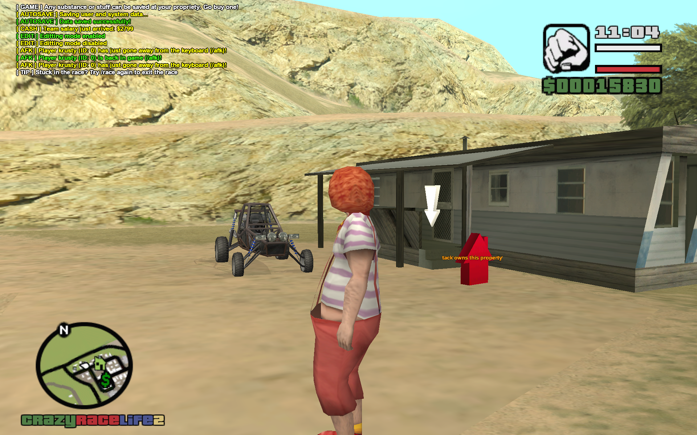
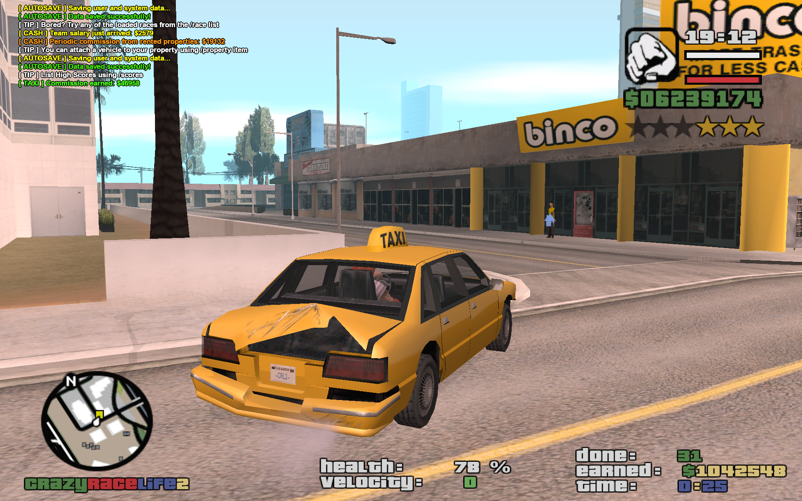

# CrazyRaceLife2 (CRL2)

CRL2 is a GTA San Andreas **SA-MP / open.mp** gamemode written in the **Pawn** language, with a built-in SQLite-backed data layer. It extends the legacy *CrazyRaceLife* gamemode (2008–2010), rebuilt from Jan 2025 onward.

A live demo runs at `95.216.7.113:39876`.

!!! info "Credits"
    krusty, kompry, DRaGsTeR, amdulka, cranyy, tack

## What this documentation covers

This site documents the gamemode's internals for developers who want to extend, fix, or operate CRL2:

- **[Getting Started](getting-started.md)** — building and running the gamemode with `sampctl`, local development, NPC connections and the Telegram webhook.
- **[Architecture](architecture.md)** — how `main.pwn` boots the gamemode, the include order in `includes.pwn`, and the conventions used across the codebase (dcmd commands, YSI-style hooks, i18n).
- **[Database Schema](database.md)** — the SQLite schema, migrations, and the thin `DB_*` wrapper used to talk to it.
- **[Commands Reference](commands.md)** — every player and admin `/command`, its access level, and where it's implemented.
- **[Localization](localization.md)** — the `i18n.pwn` translation system (English + partial Czech).
- **[Modules](modules/index.md)** — one page per gameplay feature in `src/modules/` (racing, real estate, taxi/tow/trucking missions, teams, combat, drugs, etc).
- **[Support Systems](support/world-and-visuals.md)** — the shared infrastructure in `src/support/` that the modules build on (pickups/objects/vehicles, dialogs, timers, networking, ...).

## Feature Overview

+ **Admin Zone** — in-game property/race/trucking-point editors, admin levels 0–5 (+RCON), per-command granularity.
+ **ATM Banking** — at least one ATM per city/town/village.
+ **Combat Missions** *(experimental)* — business robbery with NPC shooters; briefcase pickup pays out $50k per mission.
+ **Deathmatch Minigame** — custom arena, "legal" PvP with no wanted level, 4-minute matches with a 45s join window.
+ **Localization** — English, partial Czech.
+ **NPC Drivers** — taxi (5× per big city), trucking (2+), race drivers (WIP).
+ **Personal Cellphone** — bound to `KEY_YES`; PMs, bank balance, service calls (mechanic, pizza, taxi).
+ **Prizes** — Tiki ($10M) and Pumpkin ($1.5M) pickups, auto-hidden once collected.
+ **Racing** — custom air/ground/naval races across the map, with stunts.
+ **Rampage Missions** *(experimental)* — 5-minute NPC street clashes.
+ **Real Estate** — custom spawn point, attached vehicle (with mods), safehouse, up to 5 properties and 5 saved skins per player.
+ **Taxi Missions** — ad-hoc NPC-spawned rides with randomized customers/destinations and completion-based commission scaling.
+ **Tow Missions** — car impound service, model-based and distance-based bonuses.
+ **Teams** — custom salaries, team-only commands and weapons, `!`-prefixed team chat.
+ **Trucking Missions** — 15+ delivery points with weighted commissions/bonuses.
+ **Tutorial** *(experimental)* — onboarding vademecum for new players.

## Screenshots


*Racing checkpoint right after joining a race.*


*Property exterior: entrance pickup, offer pickup, attached vehicle.*


*A random customer for a Taxi mission.*


*Trucking mission HUD, truck marked while the mission is paused.*

See the project's `README.md` (repository root) for the full screenshot gallery and MapUI (map data visualizer) instructions.

## Source Layout

```text
src/
├── main.pwn              # OnGameModeInit/Exit, top-level callbacks
├── db/sql.pwn            # SQLite connection bootstrap
├── modules/              # One file per gameplay feature
└── support/              # Shared infrastructure used by modules
sql/migrations/           # goose-style SQL migrations (SQLite schema)
gamemodes/                # Compiled .amx output
```
