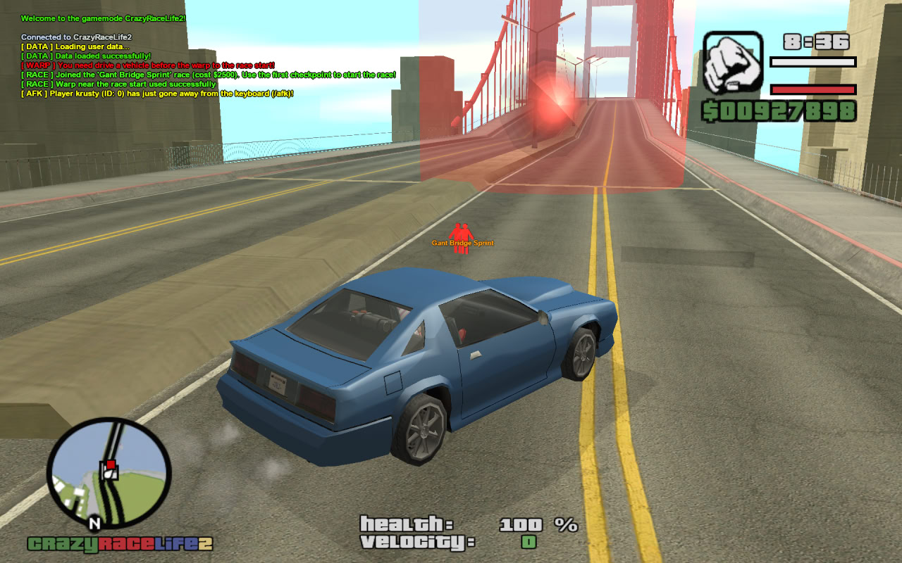

# Racing

Implements CRL2's multiplayer racing minigame: race definitions and checkpoints loaded from SQLite, registration with an entry fee and a shared 20-second countdown, a precalculated 3-wide starting grid oriented along the track, per-checkpoint progression with live position ranking and a HUD timer, prize payout and high-score recording on finish, and an in-game race editor for admins to author new tracks.



**Source:** `src/modules/race.pwn` (~1080 lines)

## Overview

Races are rows in the `races`/`race_coords` tables (see [Database Schema](../database.md)), loaded by `Race_Init()` into `gRaces[MAX_RACE_COUNT]` (`MAX_RACE_COUNT` = 64), **indexed by the database `id` column** — a `raceid` in code and a `races.id` in SQL always mean the same thing. Each `Race` has a `Type` (1 = ground vehicle, 2 = air — selects `CP_TYPE_GROUND_*` vs `CP_TYPE_AIR_*` checkpoint types), a `CostDollars` entry fee, a `PrizeDollars` payout, and a `Start` coordinate; `Race_Init()` also drops a pickup and a 3D text label at each race's start, and clears `IsPrepared` so cached track data is re-derived after the editor rewrites a race.

Per-player race state lives in `gPlayerRace[playerid]` (a `PlayerRace` struct): the joined `RaceID`, an `IsRegistered` flag, elapsed time, current ranking `Position`, checkpoint progress, and the timestamp of the last checkpoint (used for tie-breaking).

### Lifecycle of a race

1. **Registration** — `Race_RegisterPlayer(playerid, raceid)` (reached from the `/race` list dialog) validates the join: connected, not in another minigame, driving a vehicle, not already racing, race exists and isn't already running, can afford the fee, and the start grid has a free slot (max `MAX_RACE_PLAYERS` = 9 racers; a full race refuses the join *before* any money changes hands). On success it charges `CostDollars`, flags `InMinigame`, stores the player in the first free `RegisteredPlayers[]` slot, warps their vehicle onto the grid, and freezes them.
2. **Preparation** (lazy, once per race until invalidated) — the first registration triggers `Race_PrepareRace()`: loads `race_coords` ordered by `seq_no` into `gRaceCoords[raceid][]`, computes the start-line facing angle from the start point toward checkpoint 0 (`Race_GetStartFacingAngle`, see below), and precalculates all 9 starting-grid coordinates (`Race_CalculateStartingCoords`).
3. **Countdown** — the first registration also arms two timers: `Race_StartRace` fires once after `RACE_COUNTDOWN_SECONDS` (20), while `Race_CountdownHelper` re-arms itself every second to flash the remaining seconds as a game text to everyone registered.
4. **Running** — `Race_StartRace` marks the race `IsActive` (blocking further joins), unfreezes all registered players, shows the HUD textdraw, and arms the per-second `Race_UpdateRaceInfoText` timer which accumulates `TimeElapsed` and redraws checkpoint progress, position (`n/m`), and elapsed `mm:ss` for every racer. Entering a race checkpoint routes `OnPlayerEnterRaceCheckpoint` → `Race_CheckCheckpoint`, which timestamps the pass, advances progress, arms the next checkpoint (`Race_SetNextCheckpoint` — the last one renders as a FINISH type), and recomputes the player's live ranking (`Race_CalculatePosition`: more checkpoints done ranks higher, earlier timestamp breaks ties).
5. **Finish/abort** — passing the final checkpoint calls `Race_AbortMinigame(playerid, true)`: prize payout, server-wide broadcast, and `Race_SaveNewScore()` (inserts a `high_scores` row and refreshes the cached top-3 via `InitHighScores()`). Death, disconnect, or quitting via the `/race` options dialog calls the same function with `success = false` (no refund of the entry fee). Either way the player's grid slot is freed, and when the last racer leaves, the race deactivates and all its timers are killed and invalidated.

### Start grid & angle math

The grid packs racers into 3-wide lines behind the start point, perpendicular to the direction of travel (start point → checkpoint 0), with a 5.0-unit gap between vehicles:

```
----- start ----->  direction of travel      lineNo:
  3     1     2                              0
  6-GAP-4     5                              1
  9     7     8                              2
```

Registration position 1 sits exactly on the start point; each line's middle (4, 7) steps one `GAP` backwards along the travel direction from the previous middle; sides offset by `GAP` along `BetaAngle` (= `AlphaAngle` + 90°). A player's index into the precalculated grid is their slot in `RegisteredPlayers[]`, so grid spots stay unique even after mid-countdown aborts.

Two angle conventions coexist and `Race_HeadingFromAngle()` is the single conversion point between them: `atan2(diffY, diffX)` returns a **math angle** (0° = east/+X, counter-clockwise) used for all trigonometry, while GTA's Z-angle/heading is **0° = north, also counter-clockwise (90° = west, 270° = east)** — so heading = math angle − 90°, *not* 90° − angle (that's a mirror image, correct only for due-north/south tracks; getting this wrong is exactly the "start rotation looks random per race" bug).

## Key Functions

| Function | Description |
|---|---|
| `stock Race_Init()` (`src/modules/race.pwn:86`) | Loads `races` rows into `gRaces[]` keyed by DB id, creates start pickups + 3D labels, resets timers/registration and invalidates cached prep. |
| `stock Race_RegisterPlayer(playerid, raceid)` (`src/modules/race.pwn:178`) | Validates and registers a player: entry fee, free-slot scan, lazy prep, countdown arming, grid placement. |
| `static Race_PrepareRace(raceid)` (`src/modules/race.pwn:288`) | One-time (until invalidated) derivation of a race's checkpoints, angles, and starting grid. |
| `static Race_HeadingFromAngle(angle)` (`src/modules/race.pwn:315`) | Converts a math angle from `atan2` into a GTA Z-angle (heading = angle − 90°, normalized). |
| `static Race_GetStartFacingAngle(raceid)` (`src/modules/race.pwn:328`) | Computes `AlphaAngle` from the start point toward checkpoint 0 via `atan2`. |
| `static Race_CalculateStartingCoords(raceid)` (`src/modules/race.pwn:353`) | Precalculates all `MAX_RACE_PLAYERS` grid coordinates into `StartingCoordX/Y[]`. |
| `static Race_SetPlayerPos(playerid, raceid)` (`src/modules/race.pwn:438`) | Freezes the driver, warps their vehicle to their grid slot, sets the start heading, zeroes velocity. |
| `public Race_CountdownHelper(raceid)` (`src/modules/race.pwn:492`) | Self-re-arming 1s timer flashing the countdown game text to all registered racers. |
| `public Race_StartRace(raceid)` (`src/modules/race.pwn:527`) | Marks the race active, unfreezes racers, arms the first checkpoints and the HUD update timer. |
| `public Race_UpdateRaceInfoText(raceid)` (`src/modules/race.pwn:560`) | Per-second HUD redraw: checkpoints done, position, elapsed time. |
| `stock Race_CalculatePosition(raceid, playerid)` (`src/modules/race.pwn:600`) | Recomputes a racer's live ranking (checkpoints done, then earliest timestamp). |
| `stock Race_CheckCheckpoint(playerid)` (`src/modules/race.pwn:650`) | Entry point from `OnPlayerEnterRaceCheckpoint`; advances progress and re-arms the next checkpoint. |
| `stock Race_LoadRaceCheckpoints(raceid)` (`src/modules/race.pwn:672`) | Loads `race_coords` (ordered by `seq_no`) into `gRaceCoords[]`, sets `CheckPointCount`. |
| `stock Race_SetNextCheckpoint(playerid, raceid)` (`src/modules/race.pwn:720`) | Arms the next (or FINISH-typed last) race checkpoint; ends the race when progress passes the final one. |
| `stock Race_AbortMinigame(playerid, bool: success)` (`src/modules/race.pwn:800`) | Ends the race for one player — payout/broadcast/high score on success — frees their slot, deactivates the race when empty. |
| `stock Race_SaveNewScore(raceid, playerid, time, vehicleModel)` (`src/modules/race.pwn:895`) | Inserts a `high_scores` row and refreshes `gHighScores` via `InitHighScores()`. |
| `stock InitHighScores()` (`src/modules/race.pwn:945`) | Loads the top-3 times per race (`high_scores` ⋈ `users`) into `gHighScores[]`. |
| `stock SaveRaceData(playerid)` (`src/modules/race.pwn:1006`) | Race editor: bulk-inserts the drafted race's `races` + `race_coords` rows, then reloads via `Race_Init()`. |

## Commands

`/race` (`dcmd_race`, `src/support/dcmd.pwn:667`) opens the race list dialog when the player isn't racing, or the in-race options dialog (which exposes quitting via `Race_AbortMinigame`) when they are. `/scores` (`dcmd_scores`) opens the high-scores dialog backed by `gHighScores`. The race editor has no dedicated `/command` — it's reached through admin dialog menus. See [Commands Reference](../commands.md).

## Data & Integration

- **`gPlayers[]` fields:** `InMinigame` (set while racing, blocks other minigames), `NewRaceID` (race id being edited, set from dialogs), `RacesHSOffset` (high-scores dialog pagination). Cash moves via `GivePlayerMoney`, not direct `gPlayers[][Cash]` writes.
- **Database tables:** `races`, `race_coords` (read/write), `high_scores` (read/insert), plus `users` for score nicknames. See [Database Schema](../database.md).
- **Calls into:** `player.pwn` (`gPlayers[][InMinigame]`), `support/dialogs.pwn` (`ShowRaceListDialog`, `ShowRaceOptionsDialog`, `ShowRaceEditorOptionsDialog`, `ShowHighScoresOptionsDialog`), `support/pickups.pwn` (`EnsurePickupCreated`), localization (`I18N_RACE_*` keys — see [Localization](../localization.md)).
- **Called from:** `src/main.pwn` — `OnGameModeInit` (`Race_Init`, `InitHighScores`), `OnPlayerEnterRaceCheckpoint:829` (`Race_CheckCheckpoint`, falling through to tow/trucking checks when it returns 0), `OnPlayerDisconnect:194` and `OnPlayerDeath:578` (`Race_AbortMinigame`); `support/response.pwn` — race list dialog (`Race_RegisterPlayer(playerid, listitem + 1)`), race options dialog (`Race_AbortMinigame`), editor save (`SaveRaceData`).
- **Editor state:** a drafted race lives in `gPlayerRaceEdit[playerid]`/`gPlayerRaceEditTrackCoords[playerid][]` (coordinate capture happens in `player.pwn`'s key-state handler under `KEY_NO`); `response.pwn` flushes the struct via `gNullRace` when drafting starts, so `EditTrackCoordNo` and other cursors never leak between editing sessions.

## Notes

- The race list dialog maps `listitem + 1` to a raceid, which assumes racable ids are contiguous from 1 — `gRaces[]` being id-keyed makes gaps possible if rows are ever deleted from `races`.
- A racer who aborts before the start keeps no refund of the entry fee (deliberate; quitting is surfaced as "ended prematurely").
- `Race_SpawnNPC`/`Race_StartInitialPlayback` in `modules/npcs.pwn` share the `Race_` prefix but belong to the NPC demo-driver plumbing ([npcs.md](npcs.md)), not this module.
- `InitHighScores()` indexes `raceIds[spec_id]` without bounds-checking against `MAX_RACE_COUNT`; `high_scores.spec_id` rows ≥ 64 would corrupt adjacent memory. Harmless with current data, worth a guard if race ids ever grow.
