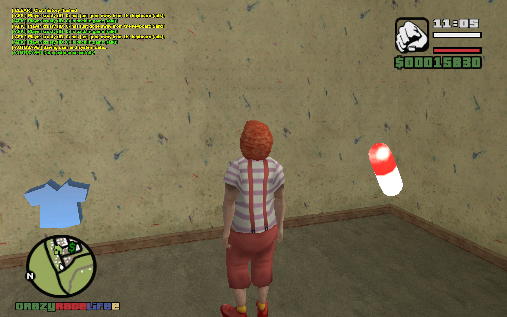
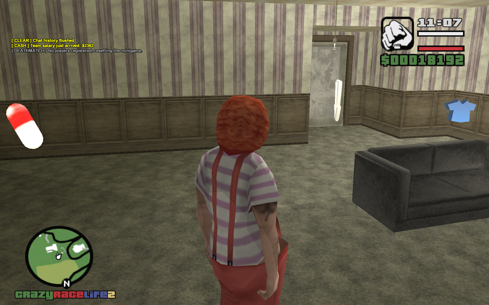
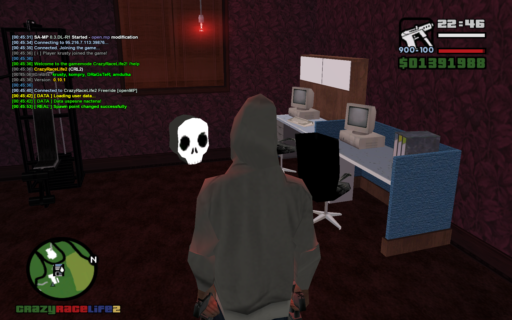
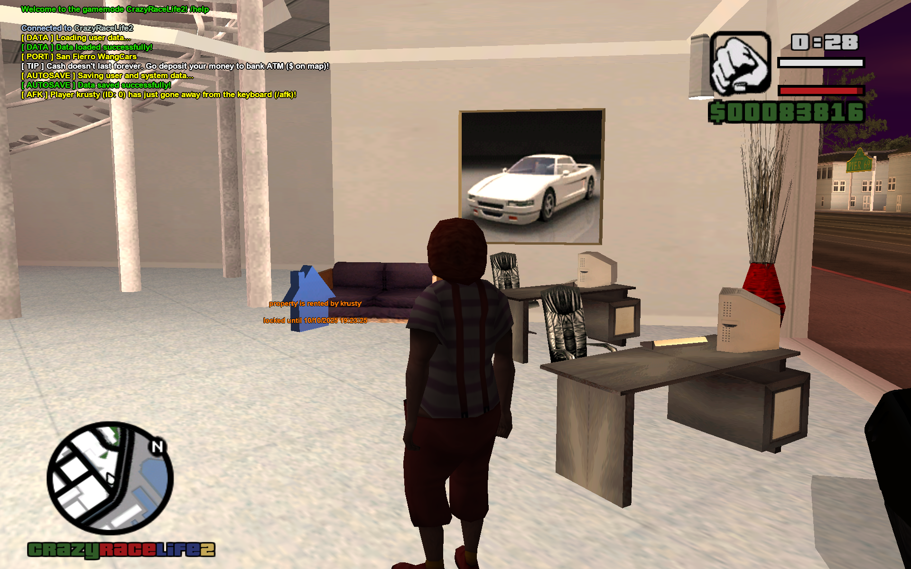

# Real Estate

The largest module in the gamemode: lets players buy personal houses or rent commercial units, each with its own spawn point, entrance/exit pickups, an optional attached vehicle, saved outfits, and a private drug stash. Includes a full admin editor for building new properties in-game.

**Source:** `src/modules/real.pwn` (~2381 lines, largest source file in CRL2)


## Overview

Up to `MAX_PROPERTIES` (384) properties exist, each described by a `Property` struct (owner `UserID`, `Label`, `Cost`, `PropertyType`, an attached `Vehicle[VehicleProps]`, up to 5 saved skins, a per-property `Drugs[MAX_DRUG_TYPES]` stash, occupancy/lock state) plus up to `MAX_PROPERTY_PICKUPS` (32) `PropertyPickup` coordinate entries per property (`PropertyPoint` enum: `SPAWN_POINT`, `ENTRANCE_POINT`, `EXIT_POINT`, `OFFER_POINT`, `VEHICLE_POINT`, `MONEY_POINT`, `SHIRT_POINT`, `HEALTH_POINT`, `DRUGZ_POINT`, `BLACK_MARKET_POINT`, `INFO_POINT`).

There are two `PropertyType`s with different economics:

- **`PROPERTY_TYPE_PERSONAL`** — bought outright (`BuyPlayerProperty`) into one of a player's `MAX_PLAYER_PROPERTIES` (7) slots; a green house-icon pickup means it's free, red means owned. Owners can `SellPlayerProperty` back for 90% of cost.
- **`PROPERTY_TYPE_COMMERCIAL`** — time-rented (`RentProperty`) rather than bought; on rent, `LockedUntilTime` is set to `gettime() + 3 * 24 * 60 * 60` (a 3-day lock protecting the new tenant), and the online former tenant is notified they were "outbought" once the lock expires and someone else rents it. `SendRealEstateCommission` runs periodically and pays every online, logged-in, non-AFK tenant a commission per owned commercial property (`floor(cost / 50) + random(cost / 100)`).

Entering a personal property's `ENTRANCE_POINT` either teleports the player into a shared, procedurally generated single-room interior (`SpawnPropertyInterior`: one room object 1500 units in the air above the property, with shirt/health/pills/exit pickups) or, if `CustomInterior` is set, simply repositions the player to a fixed secondary coordinate (a hand-built SA:MP interior) — see the interior screenshots below. A `BLACK_MARKET_POINT` pickup (custom-interior only) opens the drug-dealing dialog; each property keeps its own drug stash synced to the shared `drugz` table (`owner_type = 2`), separate from the player's personal `Drugs[]`.

Properties can each own one attached vehicle (`VehicleProps`: model, paintjob, colours, 16 mod components), lockable to everyone but the property; `AttachVehicleToProperty`, `RespawnPropertyVehicle`, `UpdatePropertyVehicle` and `UpdatePropertyVehiclePaintjob` manage it. `SetSpawnPointAtProperty` lets an owner choose which of their properties they respawn at after death.

The **Property Editor** (admin-only, reached via `/edit` → "Property Editor") walks through `PropertyEditingType` steps (`PREDIT_SPAWN_POINT`, `ENTRANCE_POINT`, `OFFER_POINT`, `MONEY_POINT`, `SHIRT_POINT`, `VEHICLE_POINT`), captured via map clicks in `modules/player.pwn`, and `EditProperty()` persists the record.






## Ownership checks

`IsPlayerOwner(playerid, propertyId)` answers "does this player own/occupy this property". It used to run

```sql
SELECT occupied FROM properties WHERE user_id = ? AND occupied = 1 AND id = ?
```

on **every call** — and several callers invoke it from inside a `MAX_PROPERTIES` (512) loop, so opening a property dialog or spawning could issue hundreds of blocking queries. crashdetect reported those as hung callbacks in `OnPlayerSpawn` and `AddMapicons`.

It is now a memory comparison against `gProperties[][UserID]` and `[Occupied]`, which mirror exactly the two columns that query read:

| path | keeps the mirror in step |
|---|---|
| `LoadRealEstateData` | loads both from `properties.user_id` / `occupied` at init |
| `SaveRealEstateData` | writes both back |
| `BuyPlayerProperty` / `SellPlayerProperty` / `RentProperty` | update both |

There is exactly one `UPDATE properties` statement in the codebase (in `RentProperty`) and it maintains both fields, so the mirror cannot silently fall behind.

!!! note "Don't use `gPlayers[][Properties]` for this"
    The per-player `Properties[]` array looks like the obvious cache but is **not** equivalent: `LoadPlayerProperties` fills it with `AND type = PROPERTY_TYPE_PERSONAL` only, and `RentProperty` never adds to it. Swapping `IsPlayerOwner` onto that array would silently break commercial properties and renting.

`IsPlayerOwnerOfArrayID(playerid, arrayid)` is the O(1) form. Most callers already hold the array index — they read `gProperties[i][ID]` to build the argument — so passing `i` directly avoids a `GetPropertyArrayIDfromID` rescan of all 512 slots. Nine call sites use it; the four that genuinely only have a property id still go through `IsPlayerOwner`.

**One behavioural consequence:** ownership now comes from memory, so editing the `properties` table directly while the server is running is no longer visible to these checks until a restart. The rest of the module already read `gProperties[]` for everything else, so live edits were mostly being ignored anyway.

## Key Functions

| Function | Description |
|---|---|
| `public InitRealEstateProperties()` (`src/modules/real.pwn:184`) | Startup hook: loads all properties from DB then spawns every property's pickups/vehicle. |
| `public SendRealEstateCommission()` (`src/modules/real.pwn:203`) | Periodic timer paying online tenants a share of their commercial properties' cost. |
| `stock SpawnProperty(propertyId)` (`src/modules/real.pwn:363`) | (Re)creates all pickups, 3D text labels and the attached vehicle for one property. |
| `stock LoadRealEstateData()` (`src/modules/real.pwn:858`) | Loads every property row plus its vehicle, saved skins and drug stash from the database. |
| `stock SaveRealEstateData()` (`src/modules/real.pwn:729`) | Upserts every property, its vehicle and its drug stash back to the database. |
| `stock LoadPlayerProperties(playerid)` (`src/modules/real.pwn:651`) | On login, populates `gPlayers[playerid][Properties]` with the player's owned personal properties. |
| `stock IsPlayerOwner(playerid, propertyId)` (`src/modules/real.pwn:707`) | Whether a player currently owns/occupies a property, by id. A memory lookup — see [Ownership checks](#ownership-checks). |
| `stock IsPlayerOwnerOfArrayID(playerid, arrayid)` (`src/modules/real.pwn:714`) | The same check in O(1), for callers that already hold the `gProperties[]` index. |
| `stock BuyPlayerProperty(playerid, propertyID)` (`src/modules/real.pwn:1257`) | Buys a free personal property into an open player slot. |
| `stock RentProperty(playerid, propertyID)` (`src/modules/real.pwn:1174`) | Rents a commercial property, applying the 3-day re-rent lock. |
| `stock SellPlayerProperty(playerid, propertyID)` (`src/modules/real.pwn:1347`) | Sells a personal property back for 90% of its cost. |
| `stock SpawnPropertyInterior(playerid, arrayID)` / `DestroyPropertyInterior(playerid)` (`src/modules/real.pwn:1027`, `:1093`) | Creates/tears down the generic generated-room interior. |
| `stock SpawnPlayerAtProperty(playerid)` (`src/modules/real.pwn:1112`) | Moves a player to their configured property spawn point; thin wrapper over the lookup below. |
| `stock GetPlayerPropertySpawnPos(playerid, &Float:x, &Float:y, &Float:z)` (`src/modules/real.pwn:1128`) | Resolves that spawn point's coordinates **without** moving anyone, so `ApplyPlayerSpawnInfo` can hand them to the client before it spawns. |
| `stock AttachVehicleToProperty(playerid, propertyid)` / `RespawnPropertyVehicle` (`src/modules/real.pwn:2046`, `:2022`) | Assigns/respawns the vehicle parked at a property's vehicle point. |
| `stock EditProperty(playerid)` (`src/modules/real.pwn:1533`) | Admin editor: saves a new or edited property record and its coordinates. |
| `stock CheckRealEstatePickup(playerid, pickupid)` (`src/modules/real.pwn:1762`) | Central pickup dispatcher covering every `PropertyPoint` type (offer, entrance, exit, health, black market, shirt, drugz, info). |
| `stock SavePropertySkin` / `SelectPropertySkin` / `DeletePropertySkin` (`src/modules/real.pwn:2169`, `:2228`, `:2253`) | Manage up to 5 outfits saved per personal property. Wearing one (`SelectPropertySkin`) goes through `SetPlayerSkinEx`, so the choice is **permanent** — it survives respawns and is persisted to `users.class`. |

## Commands

`/property` (access level "all") opens the property list dialog. `/unlock` (access level "all", implemented in `dcmd.pwn` but reads `gProperties` directly) remotely unlocks and starts an owned property vehicle when standing near it. Buying, renting, selling, attaching a vehicle and choosing a spawn point are all driven by walking onto `OFFER_POINT`/`ENTRANCE_POINT`/`VEHICLE_POINT` pickups and answering the resulting dialogs, not by typed commands. The Property Editor is reached only via the admin `/edit` command (RCON or admin level 4+). See [Commands Reference](../commands.md) for full details.

## Data & Integration

Reads/writes `gPlayers[playerid][OrmID]`, `Properties[MAX_PLAYER_PROPERTIES]`, `SpawnPoint`, `InsideProperty`, `EditingMode`, `PropertyOwnedID`, `Drugs[]`, `IsLogged`, `AFK` — see [player.md](player.md). Database tables touched: `properties`, `property_coords`, `property_skins`, `vehicles`, `drugz` (`owner_type = 2`), and `users` (for owner nicknames) — see [../database.md](../database.md). Integrates with `support/dialogs.pwn` and `support/response.pwn` (all buy/rent/sell/edit dialogs), `support/pickups.pwn` (pickup creation), `modules/drugz.pwn` (the drug-dealing and black-market dialogs), and `modules/player.pwn` (editor map-click capture, property loading on login). Localized strings use `I18N_REAL_*` keys — see [../localization.md](../localization.md).

## Notes

- Each property carries its **own drug stash** (`Drugs[MAX_DRUG_TYPES]`, table `drugz` with `owner_type = 2`) independent of the player's personal inventory — properties double as stash houses in the drug economy, not just static real estate.
- See [Ownership checks](#ownership-checks) for why `IsPlayerOwner` no longer touches the database, and the one behavioural consequence of that.
- In `EditProperty()`, the inserts for spawn/entrance/offer/money/shirt/vehicle coordinates are all guarded by `!existingRecord` — meaning **editing an already-existing property through this dialog flow never persists updated coordinates**, only top-level fields (name/cost/type/occupied/custom_interior) get saved via the `ON CONFLICT` upsert.
- `SpawnPlayerEntrancePickups` is entirely commented out, and `SellPlayerProperty` contains large commented-out remnants referencing an older `Pickups[PICKUP_TYPE_*]` layout that no longer matches the current `PropertyPoint`-indexed `gPropertyCoords` structure.
- Property-attached vehicles are locked for everyone (`SetVehicleParamsEx(..., true, ...)`) twice in a row in `SpawnProperty` (once before, once after applying components) — redundant but harmless.
