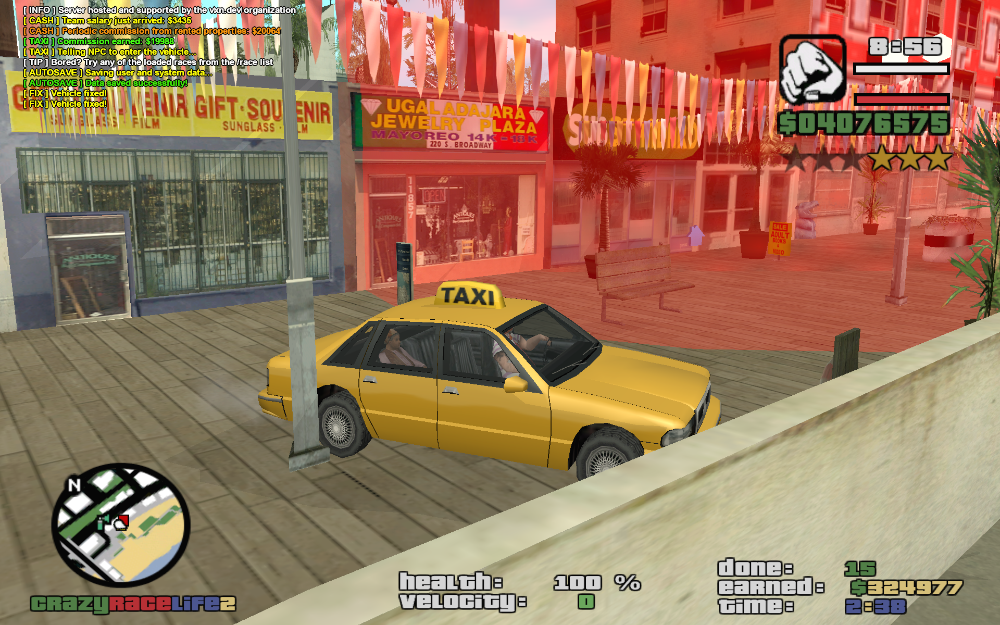
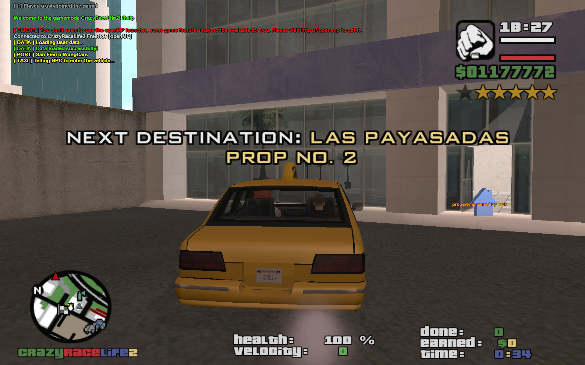

# Taxi Missions

A player-driven taxi minigame: pick up a spawned NPC customer in a taxi cab, drive them to a randomly chosen destination in the selected city, and collect a distance-scaled cash commission per completed fare.

**Source:** `src/modules/taxi.pwn` (~523 lines)





## Overview

An `AREA_LV`/`AREA_SF`/`AREA_LS`/`AREA_ALL` selector scopes destinations to one city (matched against `property_coords`/`properties` rows of `type = 8` whose name is prefixed `LV:`, `SF:` or `LS:`) or all of them. Per-player state lives in `gTaxiMission[playerid]` (`TaxiMission`): the customer NPC id, the taxi vehicle id, active flag, a distance-based `CommissionCoef`, elapsed time, earnings, completed-fare count, the current checkpoint, and several timers.

`SetPlayerTaxiMission(playerid, areaid)` starts (or, if already active, aborts) a mission. Starting requires the player to be driving a taxi cab (model 420 "Taxi" or 438 "Cabbie", via `IsPlayerInTaxiCab`) and not already in another minigame. `SetTaxiMissionCustomer` creates (or repositions) an NPC named `[NPC]taxi_custN`, placed at a random type-8 `property_coords` row within 175m of the player (`SetTaxiMissionCustomerPos`), given a random skin, and marked yellow on the player's radar. A 2s timer (`CheckTaxiNearNPC`) waits for the player to stop the (correct-model) vehicle within 15m of the NPC, then scripts the NPC into the vehicle (`EnterVehicleTimer`/`NPC_EnterVehicle`); another 2s timer (`CheckNPCInVehicle`) waits for the NPC to actually be seated before calling `SetTaxiMissionCheckpoint`, which rolls a new destination (excluding anything within 75m of the player) and sets a checkpoint + GameText with the destination's name.

Both point pickers put the distance test **in the query** rather than re-rolling a random row until one happens to satisfy it:

```sql
... AND ((c.primary_x - px)*(c.primary_x - px)
       + (c.primary_y - py)*(c.primary_y - py)
       + (c.primary_z - pz)*(c.primary_z - pz)) >= 5625.0   -- 75², or <= 30625.0 for 175²
ORDER BY random() LIMIT 1
```

That matters because the old loops were expensive and, in one case, unbounded. Measured against the shipped data: only **2 of 79** Las Venturas points fall within the customer radius of the default spawn, so `SetTaxiMissionCustomerPos` needed ~40 random picks on average — each a blocking query — and capped at 250. `SetTaxiMissionCheckpoint` used `for(;;)` with no cap at all: in an area whose points all sit within 75m of the player it could never exit, hanging the server. Each is now one query, or two when nothing satisfies the constraint and it falls back to any point in the area. Radii are named constants (`TAXI_DESTINATION_MIN_DIST`, `TAXI_CUSTOMER_MAX_DIST`).

Reaching that checkpoint (`CheckTaxiMissionCheckpoint`, invoked from the main pickup/checkpoint callback) pays `5000 + CommissionCoef * (random(DoneCount + 1) + 1) * 2500` — so payout scales with pickup-to-drop-off distance and grows more variable the more fares are completed — makes the NPC exit (`ExitVehicleTimer` repositions it as the next customer 2s later), and resets the timer. `CheckTaxiVehicle` (1.5s) aborts the run's checkpoint if the player leaves the taxi. `AbortPlayerTaxiMission` tears everything down and calls `SaveTaxiMissionScore`.

## Key Functions

| Function | Description |
|---|---|
| `public EnterVehicleTimer(npcid)` (`src/modules/taxi.pwn:67`) | Scripts the waiting customer NPC into the player's stopped taxi. |
| `public CheckTaxiVehicle(playerid)` (`src/modules/taxi.pwn:109`) | 1.5s watchdog: aborts the checkpoint/marks the vehicle if the player isn't in their taxi. |
| `public CheckTaxiNearNPC(playerid)` (`src/modules/taxi.pwn:132`) | 2s watchdog: triggers NPC pickup once the taxi is stationary near the customer. |
| `public CheckNPCInVehicle(playerid)` (`src/modules/taxi.pwn:169`) | Confirms the NPC boarded before generating the drop-off checkpoint. |
| `stock CheckTaxiMissionCheckpoint(playerid)` (`src/modules/taxi.pwn:211`) | Checkpoint-reached handler: pays commission and starts the next leg. |
| `stock SetTaxiMissionCheckpoint(playerid)` / `SetTaxiMissionCustomerPos(playerid)` (`src/modules/taxi.pwn:245`, `:358`) | Roll a random destination / customer spawn point for the current area. |
| `stock SetTaxiMissionCustomer(playerid)` (`src/modules/taxi.pwn:454`) | Creates the customer NPC on first use, or repositions the existing one. |
| `stock SetPlayerTaxiMission(playerid, areaid)` (`src/modules/taxi.pwn:516`) | Starts/aborts a taxi mission for the given area. |
| `stock AbortPlayerTaxiMission(playerid)` (`src/modules/taxi.pwn:565`) | Cleans up timers/NPC/textdraw and saves the run's score. |
| `stock SaveTaxiMissionScore(playerid)` (`src/modules/taxi.pwn:605`) | Writes the completed-fare count to `high_scores`. |

## Commands

`/taxi` (access level "all") — aborts an active mission, or opens the area-selection dialog (`ShowTaxiMissionOptionsDialog`) otherwise. The same action is also reachable via the `KEY_SUBMISSION` key while driving a taxi cab (handled in `modules/player.pwn`), which aborts an active run or opens the same options dialog. See [Commands Reference](../commands.md) for full details.

## Data & Integration

Reads/writes `gPlayers[playerid][InMinigame]`, `Locale` (for localized strings), and `OrmID` (score attribution) — see [player.md](player.md). Touches `property_coords`/`properties` (destination points, `type = 8`) and `high_scores` (`type = 3`, `spec_id = AreaID`) — see [../database.md](../database.md). Uses `I18N_TAXI_MISS_*` keys — see [../localization.md](../localization.md). The customer NPC here is separate from the ambient roaming taxi-driver NPCs spawned by `modules/npcs.pwn` (link [npcs.md](npcs.md)) — this module only ever manages one "passenger" NPC per active mission via raw `NPC_*` natives.

## Notes

- The NPC-slot scan in `SetTaxiMissionCustomer` hardcodes a 25-slot buffer (`new npcs[25]`) rather than reusing a shared constant, unlike `rampage.pwn`'s 128-slot scans.
- README lists "NPC drivers... 5x Taxi driver per big city (WIP)" — that refers to the ambient driver NPCs in `modules/npcs.pwn`, not the mission-customer logic documented here.
