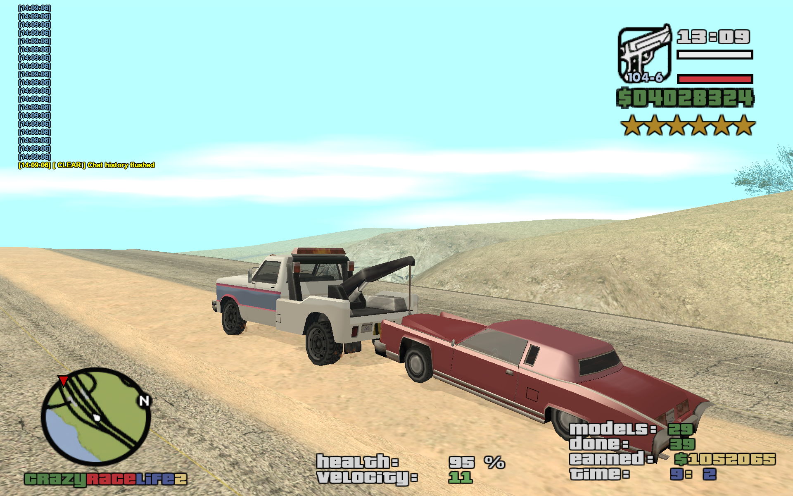

# Tow Missions

A player-driven minigame: haul a flatbed tow truck, hitch up parked vehicles found around the map, and deliver them to a fixed San Fiero dock checkpoint for a commission that scales with distance travelled and grows for previously-unseen vehicle models.

**Source:** `src/modules/tow.pwn` (~349 lines)

## Overview

Per-player state lives in `gTowMission[playerid]` (`TowMission`): active flag, truck/towed vehicle IDs, `ModelCount` (distinct models towed), `DoneCount`, elapsed time, earnings, a `CommissionBonusWeight` derived from distance, two timers, and a `Models[MAX_VEHICLE_MODELS]` (211) boolean bitmap tracking which vehicle models have already earned their one-time bonus. The delivery target is fixed: the San Fiero dock (`DOCK_SF_X/Y/Z`).

`ToggleTowMission` (bound to `/tow`) starts or aborts a run; starting requires the player to be driving the tow truck (model 525, `VEHICLE_ID_TOW_TRUCK`) and not already in another minigame. `OperateTowTruck` — bound to the `KEY_SUBMISSION` key while a tow mission is active (handled in `modules/player.pwn`) — either detaches an already-hitched trailer, or (if the truck is stationary) scans nearby stopped vehicles within 9m and attaches the first match via `AttachTrailerToVehicle`; on attach it computes `CommissionBonusWeight` from the straight-line distance to the dock (`(|ΔX| + |ΔY|) / 3000 / 2`) and sets a race checkpoint at the dock. A 1.5s timer (`CheckPlayerTowTrailerAttached`) keeps the checkpoint in sync with attachment state and marks the truck on the player's radar with a "return to truck" prompt if they've dismounted.

Reaching the dock checkpoint (`CheckTowMissionCheckpoint`, invoked from the main checkpoint callback) detaches the trailer, respawns the towed vehicle, and pays `5000 + CommissionBonusWeight * random(++DoneCount) * 5000`, plus a one-time `2500` bonus (with a localized "vehicle model bonus" message naming the model) the first time that particular model is towed (`CheckVehicleModelTowed`). Scores are saved on abort via `SaveTowMissionScore` to `high_scores` (`type = TYPE_MISSION_TOW` = 6, `spec_id = ModelCount`, `value = DoneCount`).

## Key Functions

| Function | Description |
|---|---|
| `public UpdateTowMissionText(playerid)` (`src/modules/tow.pwn:47`) | 1s timer updating the mission HUD textdraw with progress/earnings/time. |
| `public CheckPlayerTowTrailerAttached(playerid)` (`src/modules/tow.pwn:68`) | 1.5s watchdog managing the dock checkpoint and "return to truck" prompt. |
| `stock CheckVehicleModelTowed(playerid, modelid)` (`src/modules/tow.pwn:108`) | Tracks which vehicle models have already earned their first-time bonus. |
| `stock AbortTowMission(playerid)` (`src/modules/tow.pwn:125`) | Saves the score and tears down timers/checkpoint/state. |
| `stock ToggleTowMission(playerid)` (`src/modules/tow.pwn:165`) | Starts a new tow run or aborts the active one. |
| `stock OperateTowTruck(playerid)` (`src/modules/tow.pwn:209`) | Attaches the nearest stationary vehicle, or detaches the current trailer. |
| `stock CheckTowMissionCheckpoint(playerid)` (`src/modules/tow.pwn:275`) | Checkpoint-reached handler: pays commission and respawns the towed vehicle. |
| `stock SaveTowMissionScore(playerid)` (`src/modules/tow.pwn:322`) | Writes the completed-tow count to `high_scores`. |

## Commands

`/tow` (access level "all") toggles the mission on/off. The attach/detach action itself is bound to the `KEY_SUBMISSION` key (handled in `modules/player.pwn`), not a separate command. See [Commands Reference](../commands.md) for full details.

## Data & Integration

Reads/writes `gPlayers[playerid][InMinigame]` — see [player.md](player.md). Writes `high_scores` (`type = 6`) — see [../database.md](../database.md). Uses `I18N_TOW_*` keys — see [../localization.md](../localization.md). Includes `support/vehicles.pwn` directly for vehicle-name lookups (`gVehicleNames`). Unlike taxi/rampage, this module spawns no NPCs at all — the ambient tow-truck traffic, if any, is unrelated ordinary SA:MP vehicle spawning, not `modules/npcs.pwn` (see [npcs.md](npcs.md)).

## Notes

- `SaveTowMissionScore`/`AbortTowMission` note `//gTowMission[playerid][DoneCount] += 1;` as a commented-out leftover in `CheckTowMissionCheckpoint` — `DoneCount` is actually incremented inline inside the commission formula (`random(++gTowMission[playerid][DoneCount])`), so the counter still advances, but the duplicate commented line suggests past confusion about where the increment happens.
