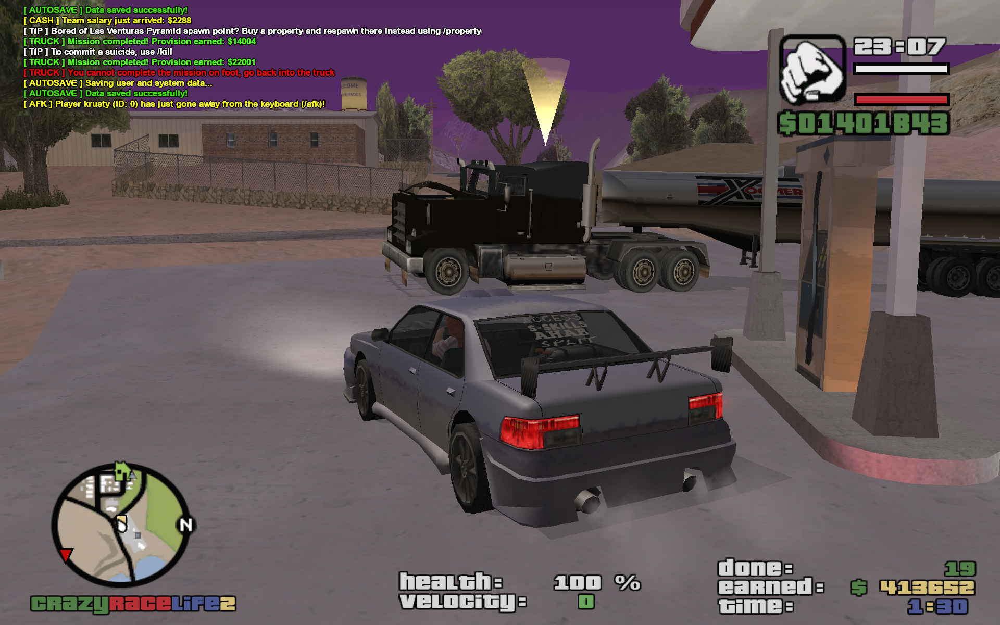
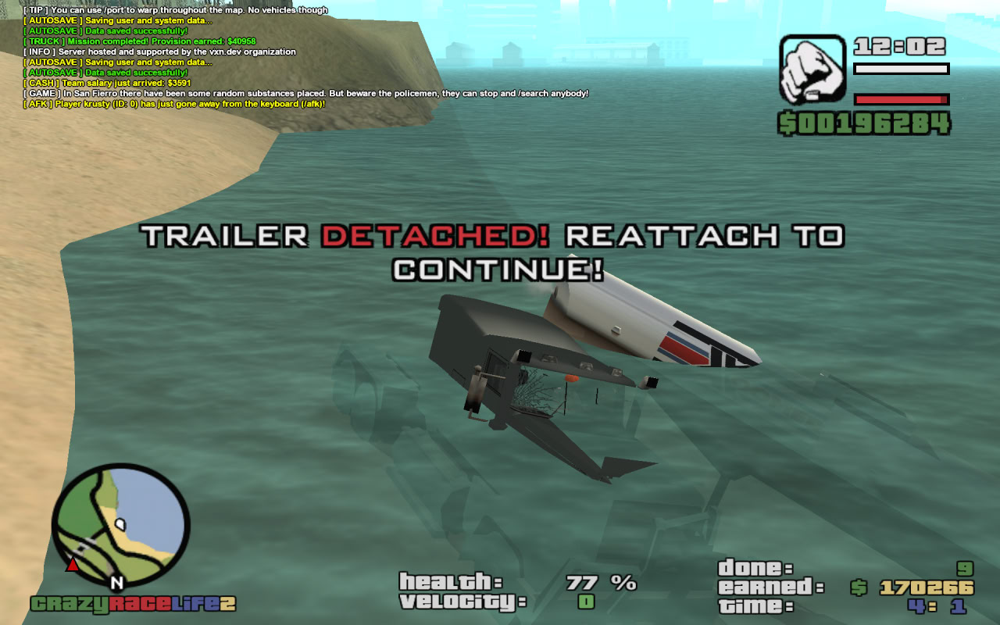

# Trucking Missions

A player-driven delivery minigame: couple a truck cab to a freight or petrol-tanker trailer at a facility, haul it to a randomly chosen trucking point of the matching type, and collect a distance-scaled commission — repeating indefinitely until aborted. Also includes an in-game editor for placing trucking points and facility vehicles.

**Source:** `src/modules/trucking.pwn` (~761 lines)

## Overview

`MissionType` distinguishes `MT_FREIGHT` (trailer models 435/450/591) from `MT_PETROL` (trailer model 584), determined from whatever trailer is attached to the player's truck when the mission starts. Up to `MAX_TRUCKING_POINTS` (128) named points are loaded from the `trucking_points`/`trucking_coords` tables (coordinate types: `CT_CHECKPOINT`, `CT_INFO_PICKUP`, `CT_JOB_PICKUP`, `CT_TRUCK_CAB`, `CT_TRAIL_FREIGHT`, `CT_TRAIL_GAS`) — `InitTrucking()` spawns the info pickups and the facility's parked truck/trailer vehicles at startup. Per-player run state is `gPlayerMissions[playerid]` (`MissionStats`): vehicle/trailer IDs, mission type, a distance-derived `CommissionBonusWeight`, `DoneCount`, elapsed time, earnings, the current checkpoint, and two timers; `gTrucking[playerid]` is the simple active/inactive flag.

`CheckPlayerForTruckingMission` (bound to `/truck` and to the `KEY_SUBMISSION` key while driving, both handled outside this file) validates the player is driving a recognized truck model (403/514/515, `IsPlayerInTruck`) with a trailer attached (`IsTrailerAttachedToVehicle`), infers the mission type from the trailer model, and — if no mission is active — calls `SetPlayerTruckingMission` to pick a random destination point of the matching facility type and starts the mission timers. `SetPlayerTruckingMission` queries a random `trucking_points`/`trucking_coords` row (excluding anything within 50m of the player, up to 50 attempts), computes `CommissionBonusWeight` from straight-line distance to that point, and sets a race checkpoint. A 1.5s timer (`CheckPlayerTrailerAttached`) keeps the checkpoint enabled only while the trailer stays attached and the player stays in the cab, showing "return to truck"/"trailer detached" prompts otherwise.

Reaching the checkpoint (`CheckTruckingCheckpoint`, invoked from the main checkpoint callback) pays `10000 + CommissionBonusWeight * (random(DoneCount) + 1) * 5000` (flat `10000 + CommissionBonusWeight * 5000` for the very first delivery), increments `DoneCount`, and immediately rolls the next destination via `SetPlayerTruckingMission` — the mission never "ends" on its own, only via `AbortTruckingMission`, which saves the score (`SaveTruckingMissionScore` → `high_scores`, `type = 4`, `spec_id = 1`, `value = DoneCount`).

The **Trucking Editor** (admin-only, via `/edit` → "Trucking Editor") uses `TruckingEditorType` steps to place a checkpoint, info pickup, and up to `MAX_VEHICLES_PER_FACILITY` (10) parked truck/freight/gas vehicles per facility; `SetTruckingPoint` persists the point and its vehicles to `trucking_points`/`trucking_coords`.

## Key Functions

| Function | Description |
|---|---|
| `public UpdateMissionInfoText(playerid)` (`src/modules/trucking.pwn:116`) | 1s timer updating the mission HUD textdraw. |
| `stock CheckTruckingCheckpoint(playerid)` (`src/modules/trucking.pwn:137`) | Checkpoint-reached handler: pays commission and immediately rolls the next destination. |
| `public CheckPlayerTrailerAttached(playerid)` (`src/modules/trucking.pwn:177`) | 1.5s watchdog keeping the delivery checkpoint in sync with trailer/cab state. |
| `stock SetPlayerTruckingMission(playerid, MissionType: missionType)` (`src/modules/trucking.pwn:223`) | Picks a random destination point matching the mission type and sets the checkpoint. |
| `stock InitTrucking()` (`src/modules/trucking.pwn:312`) | Startup hook: loads trucking points/coords and spawns facility vehicles and info pickups. |
| `stock SetTruckingPoint(playerid)` (`src/modules/trucking.pwn:427`) | Editor: persists a trucking point plus its facility vehicles to the database. |
| `stock SaveTruckingMissionScore(playerid)` (`src/modules/trucking.pwn:593`) | Writes the completed-delivery count to `high_scores`. |
| `stock AbortTruckingMission(playerid)` (`src/modules/trucking.pwn:624`) | Ends the active mission, saving the score and cleaning up timers/state. |
| `stock IsPlayerInTruck(playerid)` (`src/modules/trucking.pwn:654`) | Checks the player's current vehicle model against the recognized truck cab list. |
| `stock CheckPlayerForTruckingMission(playerid)` (`src/modules/trucking.pwn:683`) | Entry point: validates truck+trailer and starts a mission if not already running. |

## Commands

`/truck` (access level "all") starts a mission (via `CheckPlayerForTruckingMission`) or aborts an active one. The same start/abort action is also reachable via the `KEY_SUBMISSION` key while driving (handled in `modules/player.pwn`). See [Commands Reference](../commands.md) for full details.

## Data & Integration

Reads/writes `gPlayers[playerid][InMinigame]` — see [player.md](player.md). Touches `trucking_points`, `trucking_coords`, and `high_scores` (`type = 4`) — see [../database.md](../database.md). Uses `I18N_TRUCK_*` keys — see [../localization.md](../localization.md). This module spawns no mission NPCs itself; the "2+ Trucking drivers" ambient NPC traffic mentioned in the README is handled entirely by `modules/npcs.pwn` (see [npcs.md](npcs.md)) and is unrelated to the player-driven delivery loop documented here.

## Notes

- `SetTruckingPoint` has a `// TODO: Make a batch query instead of sending multiple queries in loop` comment — facility vehicles are currently persisted with one `INSERT` per vehicle.
- The delivery loop is open-ended by design: `CheckTruckingCheckpoint` always immediately requests a new destination, so a trucking "mission" really is a continuous shift that only stops when the player aborts it (or disconnects).
